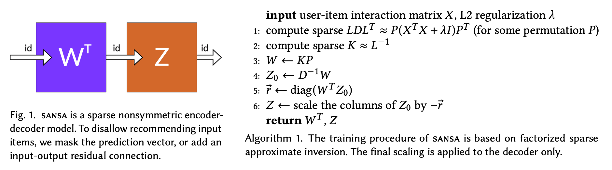

# SANSA: how to compute EASE on million item datasets

[](https://opensource.org/licenses/Apache-2.0)
[](https://paperswithcode.com/sota/recommendation-systems-on-amazon-book?p=scalable-approximate-nonsymmetric-autoencoder)
[](https://paperswithcode.com/sota/collaborative-filtering-on-million-song?p=scalable-approximate-nonsymmetric-autoencoder)

Official implementation of scalable collaborative filtering model **SANSA**.



> **Scalable Approximate NonSymmetric Autoencoder for Collaborative Filtering**  
> Spišák M., Bartyzal R., Hoskovec A., Peška L., Tůma M.  
> Paper: [10.1145/3604915.3608827](https://doi.org/10.1145/3604915.3608827)
> 
> *Best Short Paper Runner-Up*, [17th ACM Conference on Recommender Systems (ACM RecSys 2023)](https://recsys.acm.org/recsys23/)

### Reproducibility
See branch [reproduce_our_results](https://github.com/glami/sansa/tree/reproduce_our_results) for codes used in experiments and complete experimental results. 

## About

SANSA is a scalable modification of [EASE](https://arxiv.org/abs/1905.03375), a shallow autoencoder for collaborative filtering, **specifically designed to handle item sets with millions of items**.
- End-to-end sparse training procedure: instead of strenuously inverting the Gramian $X^TX$ of user-item interaction matrix $X$, SANSA efficiently finds a *sparse approximate inverse* of $X^TX$. 
- Training memory requirements are proportional to the number of non-zero elements in $X^TX$ (and this can be improved further).  
- The model's density is prescribed via a hyperparameter. 
- As a sparse neural network, SANSA offers *very fast inference* times.

### Learn more in our [short paper](https://dl.acm.org/doi/10.1145/3604915.3608827), or check out the conference [poster](assets/poster.pdf).

## Installation
### Prerequisites
Training of SANSA uses [scikit-sparse](https://github.com/scikit-sparse/scikit-sparse), which depends on the [SuiteSparse](https://github.com/DrTimothyAldenDavis/SuiteSparse) numerical library. To install SuiteSparse on Ubuntu and macOS, run the commands below: 
```bash
# Ubuntu
sudo apt-get install libsuitesparse-dev

# macOS
brew install suite-sparse
```
Note that `brew` installs SuiteSparse objects to non-standard location. Before installing the package, you need to set
the correct path to SuiteSparse by setting the following 2 environment variables:
```bash
export SUITESPARSE_INCLUDE_PATH={PATH TO YOUR SUITESPARSE}/include/suitesparse
export SUITESPARSE_LIBRARY_PATH={PATH TO YOUR SUITESPARSE}/lib
```
You can find `{PATH TO YOUR SUITESPARSE}` by running `brew info suite-sparse`.

### Installation from source
With SuiteSparse path correctly specified, simply run
```bash
pip install .
```
in the root directory of this repository.

## License
Copyright 2023 Inspigroup s.r.o.

Licensed under the Apache License, Version 2.0 (the "License");
you may not use this file except in compliance with the License.
You may obtain a copy of the License at

[https://github.com/glami/sansa/blob/main/LICENSE](https://github.com/glami/sansa/blob/main/LICENSE)

Unless required by applicable law or agreed to in writing, software
distributed under the License is distributed on an "AS IS" BASIS,
WITHOUT WARRANTIES OR CONDITIONS OF ANY KIND, either express or implied.
See the License for the specific language governing permissions and
limitations under the License.

## Cite us
Please consider citing our paper:
```
@inproceedings{10.1145/3604915.3608827,
author = {Spi\v{s}\'{a}k, Martin and Bartyzal, Radek and Hoskovec, Anton\'{\i}n and Peska, Ladislav and T\r{u}ma, Miroslav},
title = {Scalable Approximate NonSymmetric Autoencoder for Collaborative Filtering},
year = {2023},
isbn = {9798400702419},
publisher = {Association for Computing Machinery},
address = {New York, NY, USA},
url = {https://doi.org/10.1145/3604915.3608827},
doi = {10.1145/3604915.3608827},
abstract = {In the field of recommender systems, shallow autoencoders have recently gained significant attention. One of the most highly acclaimed shallow autoencoders is easer, favored for its competitive recommendation accuracy and simultaneous simplicity. However, the poor scalability of easer (both in time and especially in memory) severely restricts its use in production environments with vast item sets. In this paper, we propose a hyperefficient factorization technique for sparse approximate inversion of the data-Gram matrix used in easer. The resulting autoencoder, sansa, is an end-to-end sparse solution with prescribable density and almost arbitrarily low memory requirements — even for training. As such, sansa allows us to effortlessly scale the concept of easer to millions of items and beyond.},
booktitle = {Proceedings of the 17th ACM Conference on Recommender Systems},
pages = {763–770},
numpages = {8},
keywords = {Algorithm scalability, Numerical approximation, Sparse approximate inverse, Sparse autoencoders},
location = {Singapore, Singapore},
series = {RecSys '23}
}
```
